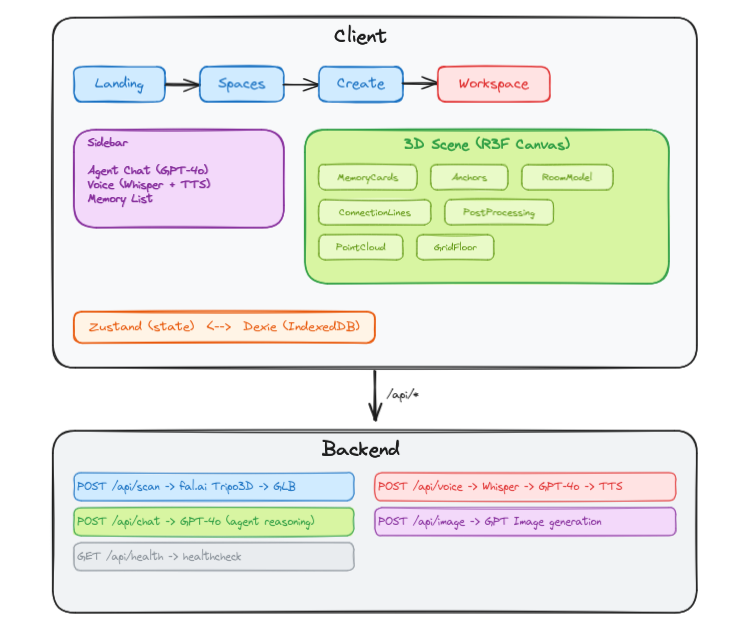

# EchoSpace

**Your room is your second brain.**

EchoSpace turns any physical space into a persistent 3D memory map. Scan your room with a webcam, speak naturally, and let an AI agent anchor notes, voice clips, and ideas exactly where they belong. Come back later — the spatial context brings everything flooding back.

> Text is lossy. Space is not.

## How It Works

1. **Scan** — Capture 2-4 photos of your space. EchoSpace generates a 3D model using Tripo3D via fal.ai.
2. **Anchor** — Click anywhere in the 3D scene to pin a memory — text, voice, or AI-generated images — to that exact location.
3. **Talk** — Speak naturally. The AI agent transcribes your voice, reasons about your memories, and anchors new ones where they belong.
4. **Recall** — Ask "what did I note here?" and the agent knows *where* that thought lives. It connects related memories, suggests tags, and surfaces forgotten decisions.

## Tech Stack

| Layer | Technology |
|-------|-----------|
| Frontend | React 19, React Three Fiber, Zustand, Dexie (IndexedDB), Motion, Tailwind CSS 4 |
| 3D Scene | Three.js, R3F Drei, Post-processing (Bloom) |
| Backend | Express 5, TypeScript |
| AI / ML | GPT-4o (reasoning), Whisper (speech-to-text), TTS (text-to-speech), GPT Image (generation) |
| 3D Reconstruction | Tripo3D v2.5 via fal.ai (multiview-to-3D) |
| Persistence | IndexedDB (client-side) via Dexie |

## Architecture



## AI Agent

The agent is context-aware. Every request sends the full spatial state — all memories, their 3D positions, tags, and connections. The agent can:

- **Answer** — Quote actual memory content when asked "what did I note?"
- **Create Memory** — Place a new memory at a known 3D position ("add a task near the laptop")
- **Connect Memories** — Link related memories across the space
- **Suggest Tags** — Add semantic tags for organization
- **Generate Images** — Create holographic visualizations from prompts
- **Narrate** — Summarize the entire space


## Getting Started

### Prerequisites

- Node.js 18+
- pnpm

### Environment Variables

Create a `.env` file in the project root:

```env
OPENAI_API_KEY=sk-...
FAL_KEY=...
PORT=3001
```

### Install & Run

```bash
# Install backend dependencies
pnpm install

# Install client dependencies
cd client && pnpm install && cd ..

# Run both backend + client
pnpm dev
```

The client runs on `http://localhost:5173` and proxies API requests to the backend on port `3001`.


## License

Built at CodexBLR Hackathon.